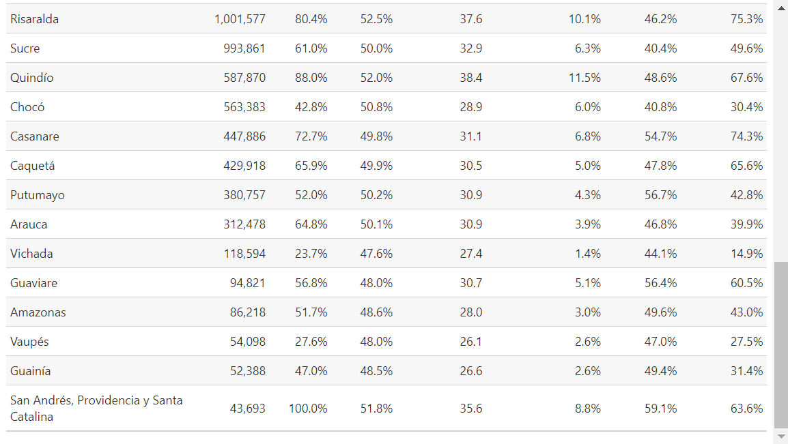
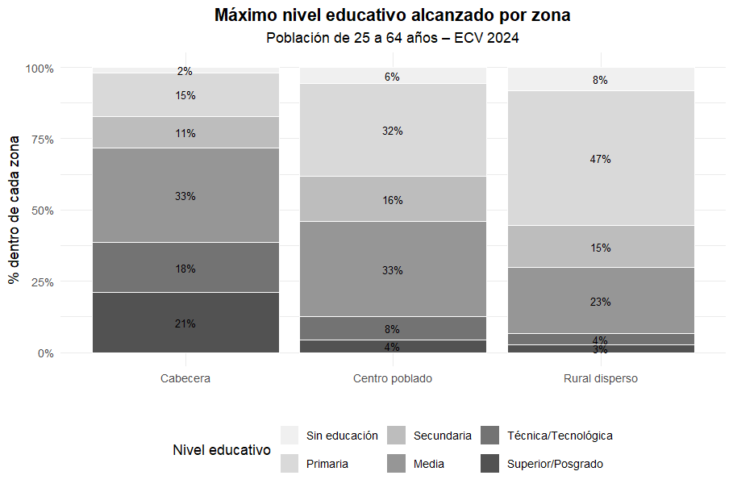

<p align="center">
  
</p>

<h1 align="center">Repositorio de Bases de Datos – ECV 2024 & IPM Colombia</h1>

<p align="center">
  <b>Economía · Econometría · Estadística Aplicada</b>
</p>

<p align="center">
  
  
</p>

---

## 📑 Tabla de Contenidos

- [📖 Acerca del Proyecto](#acerca-del-proyecto)
- [📁 Estructura del Repositorio](#estructura-del-repositorio)
- [⚙️ Componentes del Proceso](#componentes-del-proceso)
- [🔧 Requisitos del Entorno](#requisitos-del-entorno)
- [▶️ Cómo Reproducir los Resultados](#cómo-reproducir-los-resultados)
- [📊 Figuras Incluidas](#figuras-incluidas)
- [📄 Licencia y Uso de Datos](#licencia-y-uso-de-datos)
- [👤 Autor](#autor)

---

## Acerca del Proyecto

Este repositorio contiene el procesamiento completo de la **Encuesta de Calidad de Vida (ECV) 2024** del DANE y la construcción del **Índice de Pobreza Multidimensional (IPM)** para Colombia utilizando la metodología de Alkire-Foster.

El proyecto forma parte del trabajo académico en **Economía Aplicada** de la Universidad Nacional de Colombia y tiene como objetivo:

- Limpiar y estructurar las bases de datos de la ECV 2024
- Construir una base de datos consolidada a nivel de hogares
- Calcular el IPM oficial de Colombia
- Generar análisis descriptivos mediante visualizaciones profesionales

Los datos procesados y las figuras resultantes pueden ser utilizados para análisis econométricos, trabajos de investigación y proyectos de política pública.

---

## Estructura del Repositorio
```
Repositorio_Bases_De_Datos/
│
├── Scripts/
│   ├── Limpieza_de_datos.R
│   ├── Construcción_Base_ECV_Personas.R
│   └── Contrucción_base_IPM_Nivel_hogar.R
│
├── Datos_Procesados/
│   ├── hogares_ML.csv
│   └── base_final.csv (IPM calculado)
│
├── Figuras/
│   ├── Piramide_poblaciona_de_colombia.png
│   ├── Indicadores.png
│   ├── Educacion.png
│   ├── Acceso_a_servicIOs_publicos.png
│   ├── Condiciones_del_hogar.png
│   └── Condiciones_ed_hacinamiento_por_zona.png
│
└── README.md
```

---

## Componentes del Proceso

### 1️⃣ **Limpieza de datos**
Script: `Limpieza_de_datos.R`

- Carga de módulos de la ECV 2024
- Depuración y estandarización de variables
- Manejo de valores perdidos y outliers
- Codificación de variables categóricas

### 2️⃣ **Construcción de base de personas**
Script: `Construcción_Base_ECV_Personas.R`

- Integración de módulos individuales
- Construcción de variables derivadas (edad, educación, empleo)
- Generación de `hogares_ML.csv` para análisis de Machine Learning

### 3️⃣ **Cálculo del IPM**
Script: `Contrucción_base_IPM_Nivel_hogar.R`

- Implementación de la metodología Alkire-Foster
- Construcción de las 15 dimensiones del IPM colombiano:
  - Logro educativo
  - Analfabetismo
  - Inasistencia escolar
  - Rezago escolar
  - Barreras de acceso a servicios de salud
  - Sin aseguramiento en salud
  - Trabajo infantil
  - Desempleo de larga duración
  - Empleo informal
  - Hacinamiento crítico
  - Material inadecuado de pisos
  - Material inadecuado de paredes
  - Inadecuada eliminación de excretas
  - Sin acceso a fuente de agua mejorada
  - Sin acceso a energía eléctrica

- Generación de índices H (incidencia), A (intensidad) y M0 (IPM)
- Exportación de `base_final.csv`

---

## Requisitos del Entorno

### Software
- **R** versión ≥ 4.0.0
- **RStudio** (recomendado)

### Paquetes de R
```r
# Manejo de datos
install.packages("tidyverse")
install.packages("dplyr")
install.packages("readr")
install.packages("haven")

# Visualización
install.packages("ggplot2")
install.packages("scales")
install.packages("RColorBrewer")

# Manejo de archivos
install.packages("openxlsx")
install.packages("data.table")
```

---

## Cómo Reproducir los Resultados

### Paso 1: Clonar el repositorio
```bash
git clone https://github.com/jmeza-data/Repositorio_Bases_De_Datos.git
cd Repositorio_Bases_De_Datos
```

### Paso 2: Descargar datos de la ECV 2024
Descarga los microdatos oficiales desde el [DANE](https://www.dane.gov.co/) y colócalos en una carpeta `Datos_Crudos/`.

### Paso 3: Ejecutar scripts en orden
```r
# 1. Limpieza
source("Scripts/Limpieza_de_datos.R")

# 2. Construcción de base de personas
source("Scripts/Construcción_Base_ECV_Personas.R")

# 3. Cálculo del IPM
source("Scripts/Contrucción_base_IPM_Nivel_hogar.R")
```

### Paso 4: Consultar resultados
- **Bases procesadas:** `Datos_Procesados/`
- **Figuras generadas:** `Figuras/`

---

## Figuras Incluidas

A continuación se presentan las principales visualizaciones generadas en el proyecto:

### Pirámide Poblacional de Colombia

*Distribución de la población colombiana por sexo y grupos de edad según la ECV 2024*

---

### Dashboard de Indicadores Clave del IPM

*Panel de control con los principales indicadores del Índice de Pobreza Multidimensional*

---

### Análisis de Dimensiones Educativas

*Análisis de logro educativo, analfabetismo, inasistencia escolar y rezago escolar*

---

### Cobertura de Servicios Públicos

*Acceso a agua potable, energía eléctrica y saneamiento básico*

---

### Condiciones de la Vivienda

*Calidad de materiales de construcción y condiciones habitacionales*

---

### Hacinamiento por Zona Geográfica

*Comparación del hacinamiento crítico entre zonas urbanas y rurales*

---

**Nota:** Todas las figuras están en formato PNG de alta resolución y listas para uso en presentaciones o documentos académicos.

---

## Licencia y Uso de Datos

### Datos
Los microdatos utilizados provienen de la **Encuesta de Calidad de Vida (ECV) 2024** del **DANE** (Departamento Administrativo Nacional de Estadística de Colombia).

- **Fuente oficial:** [DANE - Encuestas](https://www.dane.gov.co/)
- **Licencia:** Uso libre para fines académicos y de investigación con atribución adecuada

### Código
El código contenido en este repositorio es de uso académico. Se permite su uso y modificación con la debida atribución al autor.

### Citación sugerida
```
Meza García, J. S. (2024). Repositorio de Bases de Datos – ECV 2024 & IPM Colombia. 
GitHub. https://github.com/jmeza-data/Repositorio_Bases_De_Datos
```

---

## Autor

**Jhoan Sebastián Meza García**  
Estudiante de Economía  
Universidad Nacional de Colombia

📧 Contacto: [GitHub - jmeza-data](https://github.com/jmeza-data)

---

<p align="center">
  <i>Desarrollado con 📊 y ☕ en Bogotá, Colombia</i>
</p>
